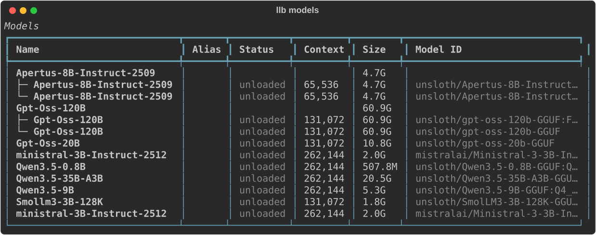
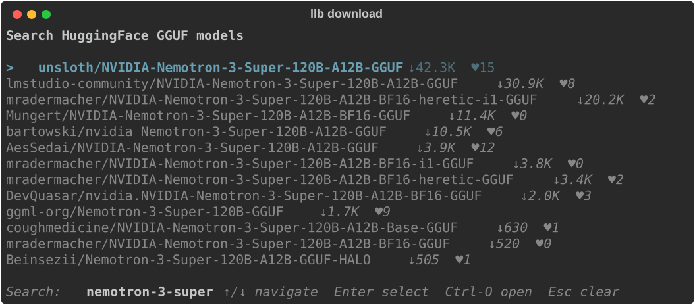
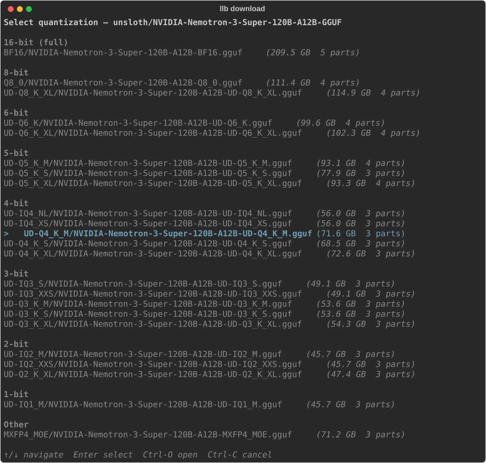
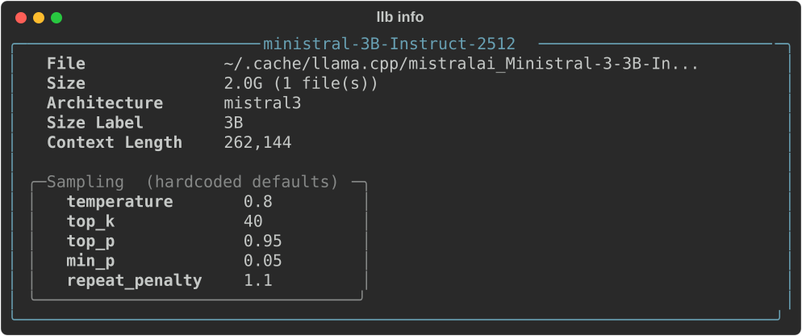

<div align="center">

# llama-buddy

**A friendly CLI wrapper for [llama.cpp](https://github.com/ggml-org/llama.cpp)**

Manage, download, and serve local LLMs with a single command.
Think of it as an ollama-like experience built on top of `llama-server`.

[](https://www.python.org)
[](LICENSE)
[](https://pypi.org/project/llama-buddy/)

</div>

---

## Features

- **Background server** &mdash; start/stop/restart `llama-server` as a daemon
- **Multi-model routing** &mdash; preset-based configuration with automatic model load/unload
- **Interactive downloads** &mdash; search HuggingFace, pick a quant, download with progress and resume
- **Rich terminal UI** &mdash; tables, panels, interactive selectors, and live search
- **GGUF inspector** &mdash; view model metadata, architecture, and sampling parameters
- **Server props** &mdash; inspect active sampling parameters on loaded models
- **Sampling sync** &mdash; automatically applies GGUF-recommended sampling params to your preset
- **Per-model settings** &mdash; context size, GPU layers, flash attention, and more
- **Idle model unloading** &mdash; background watchdog automatically unloads models after configurable idle timeout
- **VRAM tracking** &mdash; automatically parses server logs to show memory usage per model
- **Auto-sync** &mdash; preset file stays in sync with the llama.cpp cache automatically

## Screenshots

<details open>
<summary><b>Model listing</b> &mdash; <code>llb models</code></summary>
<br>
<p align="center">
  <picture>
    <source media="(prefers-color-scheme: dark)" srcset="assets/models.svg">
    <source media="(prefers-color-scheme: light)" srcset="assets/models.svg">
    
  </picture>
</p>
</details>

<details open>
<summary><b>Interactive download</b> &mdash; <code>llb download</code></summary>
<br>
<p align="center">
  <picture>
    <source media="(prefers-color-scheme: dark)" srcset="assets/download.svg">
    <source media="(prefers-color-scheme: light)" srcset="assets/download.svg">
    
  </picture>
</p>
<p align="center">
  <picture>
    <source media="(prefers-color-scheme: dark)" srcset="assets/download-quant.svg">
    <source media="(prefers-color-scheme: light)" srcset="assets/download-quant.svg">
    
  </picture>
</p>
</details>

<details open>
<summary><b>Model info</b> &mdash; <code>llb info</code></summary>
<br>
<p align="center">
  <picture>
    <source media="(prefers-color-scheme: dark)" srcset="assets/info.svg">
    <source media="(prefers-color-scheme: light)" srcset="assets/info.svg">
    
  </picture>
</p>
</details>

## Installation

```bash
pipx install llama-buddy
```

Or with [uv](https://docs.astral.sh/uv/):

```bash
uv tool install llama-buddy
```

This installs the `llb` command into an isolated environment and adds it to your `PATH`.

### Prerequisites

- Python 3.10+
- [llama.cpp](https://github.com/ggml-org/llama.cpp) installed and `llama-server` on your `PATH`

## Quick start

```bash
# Download a model (interactive search)
llb download

# Or specify directly
llb download mistralai/Ministral-3-3B-Instruct-2512-GGUF:Q4_K_M

# Start the server
llb start

# List all models
llb models

# Chat with a model (uses llama-cli)
llb chat

# Inspect model metadata
llb info

# Show active sampling params for a loaded model
llb props

# Apply GGUF-recommended sampling params to all models
llb info --apply-sampling

# Configure settings (interactive TUI)
llb settings

# Open the web UI in your browser
llb open

# Stop the server
llb stop
```

## Commands

| Command | Description |
|---------|-------------|
| `llb start` | Start `llama-server` in the background. Extra args are forwarded. |
| `llb stop` | Stop the running server. |
| `llb restart` | Restart the server. |
| `llb status` | Show whether the server is running. |
| `llb models` | List all models with status, size, VRAM usage, and grouping. Supports `--sort size`. |
| `llb download [model]` | Download a model. Interactive HF search when no model given. |
| `llb remove [model]` | Remove a model with confirmation dialog. `--keep-files` to preserve GGUFs. |
| `llb info [model]` | Show GGUF metadata. Interactive selector when no model given. |
| `llb info --apply-sampling [model]` | Write GGUF sampling params into the preset. All models when no model given. |
| `llb props [model]` | Show active server sampling params for a loaded model. |
| `llb settings` | Interactive editor for global and per-model settings. |
| `llb chat [model]` | Interactive chat via `llama-cli`. Model selector when no model given. |
| `llb open` | Open the `llama-server` web UI in your browser. |
| `llb logs` | Tail the server log file. |

## Configuration

Config files live in `~/.config/llama/`:

| File | Purpose |
|------|---------|
| `models.ini` | Model preset file &mdash; sections are HF repo IDs, auto-synced with cache |
| `settings.json` | Global server settings (port, context size, GPU layers, etc.) |
| `vram.json` | Cached per-model VRAM usage (parsed from server logs) |
| `server.pid` | PID of the running server |
| `server.log` | Server stdout/stderr |

### Per-model settings

Run `llb settings` and select **Model Settings** to configure per-model overrides:

- Context size, GPU layers, flash attention
- Custom aliases
- Any `llama-server` parameter

## Development

```bash
# Clone and install
git clone https://github.com/thilomichael/llama-buddy.git
cd llama-buddy
uv sync

# Run
uv run llb <command>

# Test
uv run pytest

# Lint
uv run ruff check src/ tests/
```

## License

MIT
